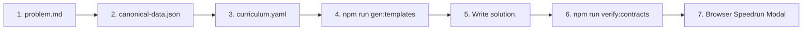

# Adding a New Problem

This guide details the contract-first lifecycle for adding a new DSA exercise to the platform. By following this standard, you guarantee that starter templates, solutions, and dynamically generated test harnesses remain 100% compatible across all supported languages.

---

## Exercise Directory Anatomy

Each exercise is organized under `src/exercises/<exercise_id>/`:

```text
src/exercises/<exercise_id>/
├── canonical-data.json      # Gold-standard test cases & metadata (required)
├── problem.md               # Markdown problem statement & constraints (required)
├── python/
│   ├── template.py          # Starter code shown in editor
│   └── solution.py          # Reference solution for verification
├── cpp/
│   ├── template.cpp         # Starter code for C++
│   └── solution.cpp         # Reference solution for C++
└── ... (other languages: go, typescript, c, ocaml)
```

---

## The 7-Step Problem Lifecycle



---

### Step 1: Write `problem.md`

Create `src/exercises/<exercise_id>/problem.md`.

* **Line 1 Title**: The very first line must be a level-1 heading with the problem title: `# Title Case Problem Name`.
* **Description**: Clear description of the problem logic.
* **Examples**: Example inputs, outputs, and explanations.
* **Constraints**: Explicit numeric and length bounds.

Example:
```markdown
# Contains Duplicate

Given an integer array `nums`, return `true` if any value appears **more than once** in the array, otherwise return `false`.

**Example 1:**
\`\`\`
Input: nums = [1, 2, 3, 3]
Output: true
\`\`\`

**Constraints:**
* `1 <= nums.length <= 10^5`
* `-10^9 <= nums[i] <= 10^9`
```

---

### Step 2: Formulate `canonical-data.json`

Create `src/exercises/<exercise_id>/canonical-data.json`.
The schema is formally defined in [`src/languages/canonical-schema.json`](../src/languages/canonical-schema.json).

#### Required Fields
* **`exercise`**: String matching the directory name (e.g. `"contains_duplicate"`).
* **`property`**: Exact function or method name (e.g. `"hasDuplicate"`).
* **`cases`**: Non-empty array of test cases. Each case requires `description`, `property`, `input`, and `expected`.

#### Optional Metadata
* **`mode`**:
  * `"function"` (default): Standard standalone function.
  * `"operations"`: Class/data structure problem (e.g. Trie, LRU Cache). `operations` array lists methods, `arguments` lists arguments, `expected` lists returns.
  * `"compose"`: Multi-function serialization (e.g. `["decode", "encode"]`).
* **`inputs`**: Semantic type hints for non-primitive arguments:
  * `"tree"`, `"tree_node"`, `"linked_list"`, `"linked_list_array"`, `"linked_list_cycle"`, `"graph"`, `"interval"`, `"interval_array"`, `"byte_grid"`.
* **`returns`**: Semantic return hint (`"tree"`, `"linked_list"`, `"graph"`, `"void"`).
* **`mutation`**: If the function modifies an argument in-place (e.g. `{ "target": "matrix" }`).
* **`comparison`**: `"exact"` (default), `"unordered"`, or `"unordered_nested"`.

Example:
```json
{
  "exercise": "contains_duplicate",
  "property": "hasDuplicate",
  "cases": [
    {
      "uuid": "15d2a321-55e4-4516-9b68-b79c50f6d55c",
      "description": "Example 1",
      "property": "hasDuplicate",
      "input": {
        "nums": [1, 2, 3, 3]
      },
      "expected": true
    },
    {
      "uuid": "9fed63af-6eb2-412c-9abd-77db6a36c20b",
      "description": "Example 2",
      "property": "hasDuplicate",
      "input": {
        "nums": [1, 2, 3, 4]
      },
      "expected": false
    }
  ]
}
```

---

### Step 3: Register in Curriculum

Add the exercise ID under the appropriate chapter in `src/exercises/curriculum.yaml`:

```yaml
chapters:
  "Arrays & Hashing":
    - contains_duplicate
    - valid_anagram
    - two_sum
```

---

### Step 4: Scaffold Starter Templates (`npm run gen:templates`)

Run the template generator:
```bash
npm run gen:templates -- --exercise=<exercise_id>
```

This uses each language's colocated type mapper in `src/languages/<lang>/test-runner.ts` to generate type-safe starter templates:
* `src/exercises/<exercise_id>/python/template.py`
* `src/exercises/<exercise_id>/cpp/template.cpp`
* `src/exercises/<exercise_id>/go/template.go`
* `src/exercises/<exercise_id>/typescript/template.ts`
* ...

> [!TIP]
> Do not manually edit the function name or parameter types in `template.<ext>` unless updating the canonical schema. The template establishes the signature contract.

---

### Step 5: Implement Reference Solutions

In each language subfolder, create `solution.<ext>`:
* The function signature **must match `template.<ext>` exactly**.
* Implement the optimal algorithm solving the problem constraints.

---

### Step 6: Static Contract Verification (`npm run verify:contracts`)

Run the contract linter:
```bash
npm run verify:contracts -- --exercise=<exercise_id>
```

This automatically verifies:
1. `canonical-data.json` matches the JSON Schema.
2. `template.<ext>` and `solution.<ext>` define the expected function/class.
3. Every language's `buildTestCode` generates a valid test harness free of anti-patterns (no illegal `to_string`, no C++ most-vexing-parse, no raw `null`s).

---

### Step 7: Runtime Speedrun Verification

Launch the development environment:
```bash
npm run dev
```
1. Click the **Speedrun** button in the header.
2. Select your language (or "All").
3. Verify that your new exercise passes 100% of its test cases in the real WebAssembly worker runtime.
