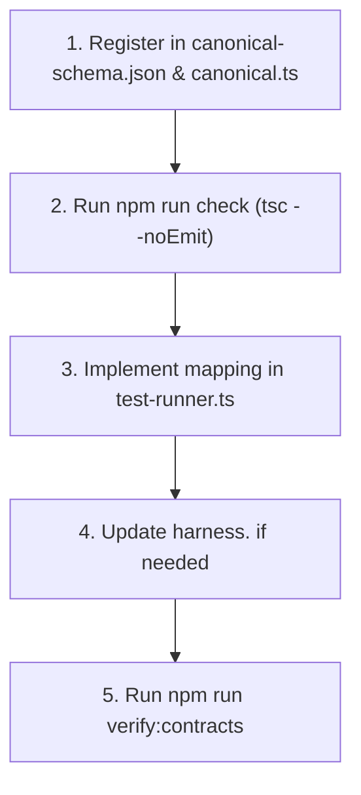

# Adding a New Canonical Type Mapping

This guide explains how to introduce a new canonical type mapping or semantic hint (e.g. `trie_node`, `bit_matrix`, `quad_tree`, `tuple`) consistently across all supported languages.

---

## When is a New Type Mapping Needed?

A new type mapping is needed when a problem uses a non-standard data structure or argument convention that cannot be inferred from standard JSON primitives (`int`, `float`, `string`, `bool`, nested arrays).

Examples of existing semantic hints:
* `"tree"`: Converts level-order array into a binary tree (`TreeNode*`, `*TreeNode`, `Optional[TreeNode]`).
* `"linked_list_cycle"`: Builds a linked list and links the tail to an index to form a cycle.
* `"graph"`: Builds an adjacency-list-backed node graph (`Node*`).
* `"interval"`: Struct with `start` and `end` fields.

---

## Step-by-Step Procedure



---

### Step 1: Register the Type in the Canonical Schema

1. Update [`src/languages/canonical-schema.json`](file:///Users/jitin/GitHub/dsa/src/languages/canonical-schema.json):
   Add the new string identifier under `CanonicalInputType` or `CanonicalReturnType`:
   ```json
   "CanonicalInputType": {
     "type": "string",
     "enum": [
       "standard",
       "tree",
       "tree_node",
       "linked_list",
       "linked_list_array",
       "linked_list_cycle",
       "graph",
       "interval",
       "interval_array",
       "byte_grid",
       "trie_node"
     ]
   }
   ```

2. Update the TypeScript union in [`src/languages/canonical.ts`](file:///Users/jitin/GitHub/dsa/src/languages/canonical.ts):
   ```ts
   export type CanonicalInputType =
     | 'standard'
     | 'tree'
     | 'tree_node'
     | 'linked_list'
     | 'linked_list_array'
     | 'linked_list_cycle'
     | 'graph'
     | 'interval'
     | 'interval_array'
     | 'byte_grid'
     | 'trie_node';
   ```

3. Update `inferCanonicalType` in `canonical.ts` to recognize the hint.

---

### Step 2: Use `npm run check` to Identify Affected Languages

Because language mappers use exhaustive TypeScript mappings (`Record<CanonicalInputType, ...>`), the TypeScript compiler will immediately pinpoint every language that needs the new mapping:

```bash
npm run check
```

Output:
```
src/languages/cpp/test-runner.ts: Property 'trie_node' is missing in type...
src/languages/go/test-runner.ts: Property 'trie_node' is missing in type...
src/languages/python/test-runner.ts: Property 'trie_node' is missing in type...
```

This ensures you never miss a language or cause silent runtime fallbacks.

---

### Step 3: Implement the Mapping in Each Language

In each `src/languages/<lang>/test-runner.ts`, define how the type should be represented for:
1. **Parameter Type**: When passed as an argument (e.g. `const TrieNode*` in C++, `*TrieNode` in Go, `TrieNode` in Python).
2. **Return Type**: When returned from a function.
3. **Template Stub**: Default return value in starter code (e.g. `nullptr`, `nil`, `None`, `null`).
4. **Harness Converter**: Any conversion needed from the raw JSON input to the language object (e.g. `list_to_trie(tc.root)`).

---

### Step 4: Update Data Structures in `harness.<ext>` (If Applicable)

If the new type introduces a shared struct or class:
1. Define the struct/class in each language's `harness.<ext>` file:
   * `src/languages/cpp/harness.hpp`
   * `src/languages/go/harness.go`
   * `src/languages/python/harness.py`
   * `src/languages/typescript/harness.ts`
   * `src/languages/c/harness.h`
   * `src/languages/ocaml/harness.ml`
2. Document the structure and constructor in [`src/languages/HARNESS.md`](file:///Users/jitin/GitHub/dsa/src/languages/HARNESS.md).

---

### Step 5: Verify Across the Curriculum

Run the contract verification script to ensure all exercises compile and all language runners satisfy the updated contract:

```bash
npm run verify:contracts
```
